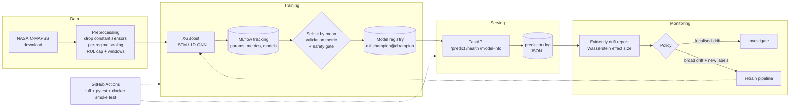

# Predictive Maintenance — RUL Prediction with MLOps

Remaining Useful Life (RUL) prediction for turbofan engines on the **NASA C-MAPSS** dataset, with the full MLOps loop around it: reproducible data pipeline, experiment tracking and a model registry (MLflow), a FastAPI service, drift monitoring (Evidently), Docker/Compose, tests and CI.

> **Headline result (FD001, official last-window test protocol, 3 seeds):** an XGBoost model on window features reaches **RMSE 13.6–13.9 cycles**. The LSTM (16.1) and 1D-CNN (19.5) I tried were **worse** with the settings explored; the ensemble did not help either. The pipeline picks the champion by *validation* metrics and reports the rest honestly — see [Results](#results).

## Architecture



The API receives **raw telemetry** and applies the *same* persisted preprocessor, window and feature code as training (guarded by a parity test), so clients cannot diverge from the model's assumptions.

## Results

FD001 (100 test engines, one prediction per engine at its last observed cycle against the true RUL). Mean ± std over 3 seeds; **lower is better**.

| Model | Test RMSE (cycles) | NASA score |
|---|---|---|
| XGBoost, window 30 | **13.62 ± 0.17** | **270 ± 7** |
| **XGBoost, window 50 (registered champion)** | 13.87 ± 0.12 | 312 ± 5 |
| Ensemble (XGB w50 + LSTM w50) | 14.20 ± 0.31 | 313 ± 28 |
| LSTM, window 30 | 15.54 ± 0.10 | 438 ± 37 |
| LSTM, window 50 | 16.05 ± 0.38 | 397 ± 48 |
| 1D-CNN, window 30 | 19.46 ± 0.40 | 951 ± 152 |

Things worth knowing before you trust these numbers:

- **Champion selection used validation only** (mean `val_rmse_deg`, RMSE on degradation-phase windows). Validation preferred window 50; test slightly prefers window 30 (13.62 vs 13.87, ~1.5 seed-stds on 100 engines — probably noise). I kept the pre-declared rule instead of switching after seeing test results.
- Deep models were **lightly tuned** (one-factor sweep, single seed per config). They may improve with a proper search; the claim is only that XGBoost wins *with what was tried*.
- Only **FD001** is tuned and evaluated end to end. FD002–FD004 pipelines exist for loading/preprocessing, but a quick FD002 baseline showed a large validation-to-test gap (14.4 → 26.5 RMSE) that was not investigated.
- Drift thresholds were calibrated on **simulated** traffic (5% false-warning rate measured there); real traffic needs recalibration.

Details, tables and negative results per phase: [docs/phases/](docs/phases/).

## Quick start

Windows/PowerShell shown; the code is plain Python 3.10+.

```powershell
python -m venv .venv
.venv\Scripts\Activate.ps1
pip install -r requirements.txt
pip install -e .                       # must be an editable install

# 1. Reproduce the whole training flow (download -> build -> train -> select -> register)
python -m pmaint.pipeline              # full, incl. LSTM candidate (~15-20 min on CPU)
python -m pmaint.pipeline --quick      # smoke run: 1 seed, XGBoost only (~1 min)

# 2. Inspect experiments and the registry
mlflow ui --backend-store-uri sqlite:///mlflow.db

# 3. Serve the champion
uvicorn pmaint.serving.app:app --port 8000
python -m pmaint.serving.sample_request --unit 24 > payload.json
curl.exe -X POST http://localhost:8000/predict -H "content-type: application/json" -d "@payload.json"
#   interactive docs: http://localhost:8000/docs

# 4. Everything in containers (MLflow server + API), then copy the champion in
docker compose up -d --build
python -m pmaint.training.promote --src sqlite:///mlflow.db --dst http://localhost:5000

# 5. Drift monitoring on simulated traffic
python -m pmaint.monitoring.simulate --scenario sensor_bias      # normal | sensor_bias | aged_fleet
python -m pmaint.monitoring.trigger --current logs/sim_sensor_bias.jsonl   # ok/investigate/retrain
docker compose --profile monitor run --rm monitor                # HTML report in reports/

# 6. Quality gates (what CI runs)
ruff check .
pytest -m "not data and not registry"
```

## Repository layout

```
src/pmaint/
  data/         download, loader, dataset builder
  features/     RUL capping, per-regime Preprocessor, windows, tabular features
  models/       LSTM and 1D-CNN regressors
  training/     train_xgb, train_deep, sweep, ensemble, registry (selection + gate), promote, metrics
  serving/      FastAPI app, predictor (registry -> model + preprocessor), schemas, sample request
  monitoring/   traffic simulator, Evidently drift analysis, replay, retrain trigger
  pipeline.py   single entry point for the whole flow
docker/, docker-compose.yml   API / MLflow / monitor images
.github/workflows/ci.yml      lint + tests + container smoke test
tests/          unit, API, training smoke (synthetic data), drift, parity tests
docs/           ROADMAP, DECISIONS (decision log), RETROSPECTIVE, phases/PHASE_00..10
notebooks/      EDA only
```

## Documentation

| Document | What it holds |
|---|---|
| [docs/RETROSPECTIVE.md](docs/RETROSPECTIVE.md) | What worked, what went wrong (and how it was caught), limitations, next steps |
| [docs/DECISIONS.md](docs/DECISIONS.md) | Every design decision with its reason, plus the ideas parking lot |
| [docs/ROADMAP.md](docs/ROADMAP.md) | The 11 phases |
| [docs/phases/](docs/phases/) | Per-phase write-up: what was built, verification, caveats, how to reproduce |
| [CLAUDE.md](CLAUDE.md) | Commands and cross-file architecture notes for AI coding assistants |

## Known limitations

- No authentication/TLS; the API is stateless (caller sends the history); predictions from very short histories are unreliable and flagged with `padded: true`.
- Registry is local SQLite (or the compose volume); no Postgres/object-storage deployment, no scheduler for the monitor, no alert delivery.
- The retrain trigger encodes a policy and can run the pipeline, but nothing feeds it new labelled data in this project.
- CI does not train on the real dataset or gate model quality.
